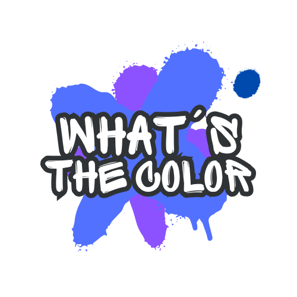
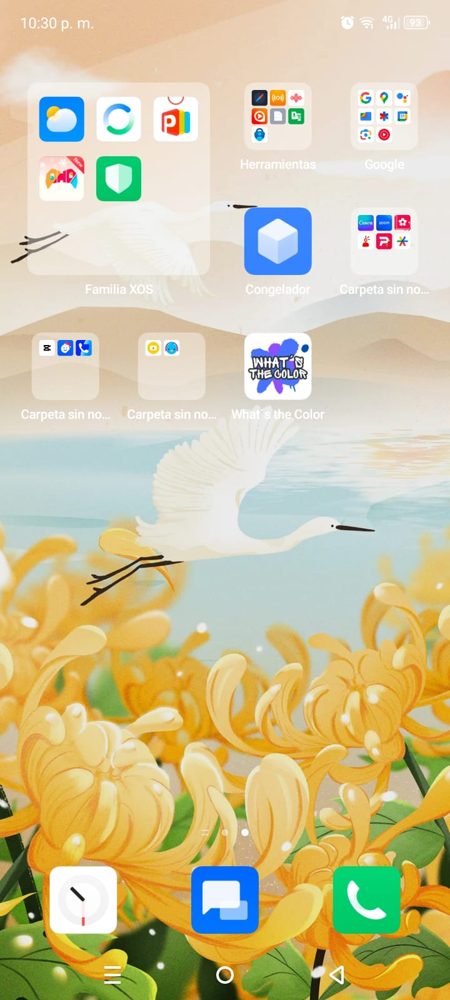
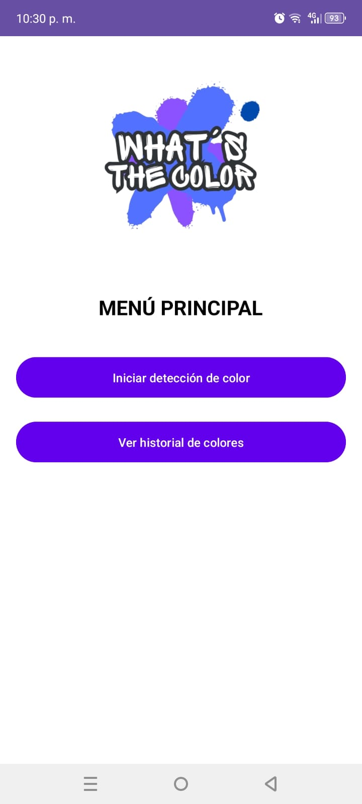
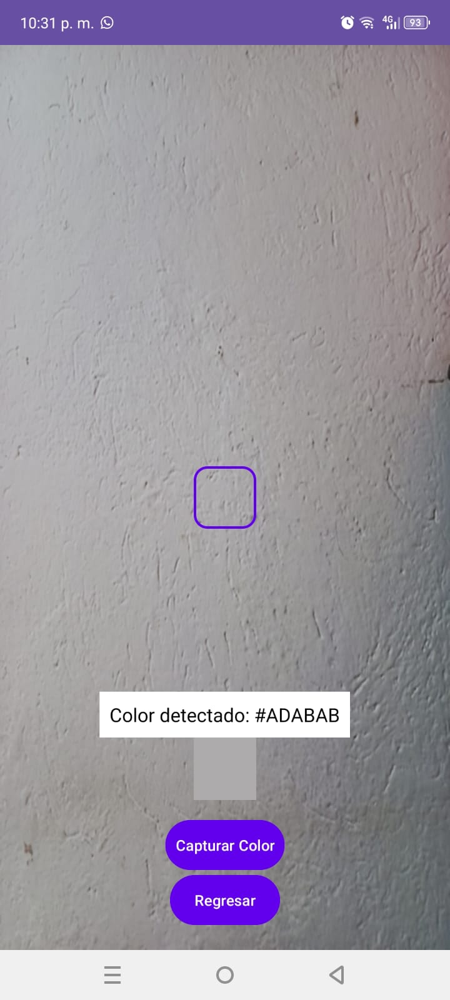
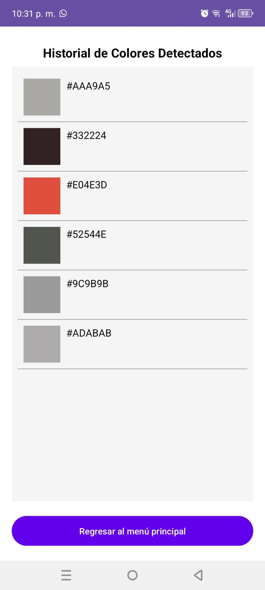

# What´s the Color

What´s the Color, es una aplicación de Android para detectar colores mediante la cámara del dispositivo. Permite visualizar el color detectado, obtener su código hexadecimal, y almacenar un historial de colores escaneados.

## Características

- **Detección de colores:** Usa la cámara para identificar colores en tiempo real.
- **Código hexadecimal:** Muestra el código hexadecimal del color detectado.
- **Previsualización del color:** Visualiza el color detectado directamente en la aplicación.
- **Historial:** Almacena y muestra los colores detectados previamente.
- **Navegación amigable:** Fácil acceso a todas las funcionalidades con un diseño intuitivo.

## Capturas de pantalla

  
  
  
  

## Requisitos

- Android 5.0 (API 21) o superior.
- Permiso de acceso a la cámara.

## Instalación

Puedes descargar el archivo APK desde el siguiente enlace:
[Descargar APK](https://drive.google.com/file/d/1xOcKXXTRibCH5WMckUheHk7eErdE0zfB/view?usp=sharing)

## Contacto

Si tienes dudas o sugerencias, no dudes en contactarme en [barreraha@itecsur.edu.ec](barreraha@itecsur.edu.ec) o abrir un issue en este repositorio.
